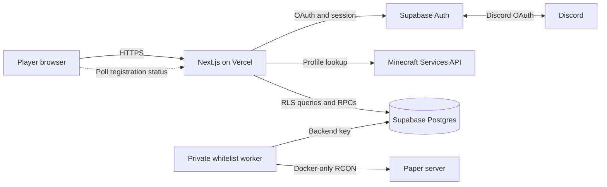

# Chulacraft web architecture

The `web` directory contains the public registration application for the
Chulacraft Minecraft Java Edition server. It lets a player authenticate with
Discord or Chula SSO, validates the player's Minecraft profile, and stores a desired
whitelist registration in Supabase.

The web application does not connect directly to Paper or RCON. A separate
worker on the Minecraft host reads registrations from Supabase and applies them
to the server.

## Runtime stack

| Layer | Technology | Responsibility |
| --- | --- | --- |
| UI and server routes | Next.js App Router, React, TypeScript | Landing page, authentication callbacks, protected registration page, and registration API |
| Hosting | Vercel | HTTPS, Next.js runtime, deployments, and public environment variables |
| Authentication | Supabase Auth with Discord OAuth and Chula SSO | Player identity, browser session, and secure cookies |
| Database | Supabase Postgres | Registration state, uniqueness rules, RLS, and durable rate limiting |
| Profile validation | Minecraft Services API | Resolves a Java username to its canonical username and UUID |
| Server synchronization | `../minecraft/whitelist-worker` | Polls Supabase and changes the Paper whitelist through private RCON |

## System boundary



Only the browser-facing Supabase URL and publishable key are present in the web
deployment. The Supabase backend key and RCON password exist only on the
Minecraft host.

## Request lifecycle

### 1. Discord sign-in

1. `AuthButton` calls `supabase.auth.signInWithOAuth()` with Discord as the
   provider.
2. The browser returns through Supabase's provider callback and then to
   `/auth/callback` on this application.
3. The callback exchanges the one-time authorization code for a Supabase
   session and writes the session cookies.
4. The player is redirected to `/welcome`, the protected registration page.
5. `src/proxy.ts` refreshes Supabase sessions for application routes.

The Discord application callback is the Supabase callback, not the Vercel
application callback:

```text
https://xtqpulleqbvoroxzheor.supabase.co/auth/v1/callback
```

### 2. Registration

The protected registration page loads only the current user's safe registration
fields. Submitting a username sends `POST /api/registration`, which:

1. Verifies the Supabase session with `auth.getUser()`.
2. Applies a best-effort in-memory IP limit.
3. Calls `consume_registration_attempt()` for the authoritative per-user limit
   of five attempts in ten minutes.
4. Validates the Java username format: 3-16 letters, numbers, or underscores.
5. Resolves the canonical username and UUID through the Minecraft Services API.
6. Calls the authenticated `register_minecraft_profile` database function.
7. Returns only the safe registration view to the browser.

The database function derives the owner from `auth.uid()` and the Discord
identity stored by Supabase. The request never supplies a user ID or Discord ID.
Unique constraints allow one registration per Discord account and one owner per
Minecraft UUID.

### 3. Whitelist synchronization

A newly created row starts with:

```text
desired_whitelisted = true
sync_status = pending
```

While a registration is not synchronized, the browser requests
`GET /api/registration` every 3.5 seconds. Separately, the private worker polls
Supabase every 8 seconds by default, sends `whitelist add <username>` through
RCON, and updates the row.

| State | Meaning shown to the player |
| --- | --- |
| `pending` | Saved in Supabase and waiting for the Minecraft host |
| `synced` | Paper accepted the whitelist operation |
| `failed` | The worker could not complete the operation and will retry |
| `desired_whitelisted = false` | An operator revoked the registration |

This asynchronous design keeps registrations durable when the home server is
offline. The worker reconciles desired registrations again when it starts.

## Routes and important modules

| Path or module | Purpose |
| --- | --- |
| `/` | Public landing page and Discord sign-in |
| `/auth/callback` | OAuth code exchange and session-cookie creation |
| `/auth/cucallback` | Chula SSO ticket validation and session creation |
| `/auth/error` | Safe user-facing OAuth failure messages |
| `/register` | Public sign-in page; authenticated users redirect to `/welcome` |
| `/welcome` | Protected registration and current sync status |
| `/api/registration` | Authenticated registration read/write API |
| `src/lib/supabase/` | Browser, server, and session-refresh clients |
| `src/lib/registration.ts` | Username validation, safe redirects, and status messages |
| `src/lib/env.ts` | Required public Supabase configuration and canonical site URL |
| `supabase/migrations/` | Tables, constraints, RLS, grants, triggers, and RPCs |
| `OPERATOR_RUNBOOK.md` | Launch, recovery, and incident procedures |

## Database security model

The migration
`supabase/migrations/202607270001_minecraft_registrations.sql` is the source of
truth for the data model.

- Row Level Security allows authenticated players to read only their own row.
- Browser roles can select only `minecraft_username`,
  `desired_whitelisted`, `sync_status`, and `updated_at`.
- Browser roles cannot insert or update table rows directly.
- `register_minecraft_profile` is the only player registration write path.
- The function is idempotent for an identical replay by the same user.
- Conflicts do not reveal which user owns a Discord or Minecraft account.
- Worker-only retry, error, Discord, and UUID fields require the backend role.
- `registration_attempt_windows` is private and accessible only through its
  authenticated rate-limit function.

The web host must never receive a Supabase secret/service-role key, Discord
client secret, or RCON password.

## Environment variables

Copy `.env.example` to `.env.local` for local development:

```env
NEXT_PUBLIC_SUPABASE_URL=https://YOUR_PROJECT_REF.supabase.co
NEXT_PUBLIC_SUPABASE_PUBLISHABLE_KEY=sb_publishable_REPLACE_ME
NEXT_PUBLIC_SITE_URL=http://localhost:3000
NEXT_PUBLIC_MINECRAFT_SERVER_ADDRESS=mc.ratchaphon.com
```

| Variable | Required | Description |
| --- | --- | --- |
| `NEXT_PUBLIC_SUPABASE_URL` | Yes | Public Supabase project URL |
| `NEXT_PUBLIC_SUPABASE_PUBLISHABLE_KEY` | Yes | Public browser-safe Supabase key |
| `NEXT_PUBLIC_SITE_URL` | Yes in production | Canonical origin used for server-side redirects |
| `NEXT_PUBLIC_MINECRAFT_SERVER_ADDRESS` | No | Address displayed and copied on the landing page |

For the custom production hostname, set:

```env
NEXT_PUBLIC_SITE_URL=https://mc.ratchaphon.com
NEXT_PUBLIC_MINECRAFT_SERVER_ADDRESS=mc.ratchaphon.com
```

`NEXT_PUBLIC_` values are included in the Next.js build. Redeploy after changing
them in Vercel.

## Local development

Prerequisites:

- Node.js compatible with the version configured by the Vercel project
- A Supabase project with Discord Auth configured
- The SQL migration applied to that project

From this directory:

```powershell
Copy-Item .env.example .env.local
npm ci
npm run dev
```

Open `http://localhost:3000`. Supabase Auth URL Configuration must include:

```text
http://localhost:3000/auth/callback
```

## Production configuration

1. Add the production hostname to the Vercel project.
2. Configure the exact CNAME record Vercel recommends.
3. Set the four public environment variables in Vercel.
4. In Supabase Auth URL Configuration, set:

   ```text
   Site URL: https://mc.ratchaphon.com
   Redirect URL: https://mc.ratchaphon.com/auth/callback
   ```

5. Keep the Discord application redirect set to the Supabase provider callback.
6. Redeploy the web project and complete one real registration smoke test.

During a domain migration, the old Vercel `/auth/callback` URL can remain in the
Supabase redirect allowlist temporarily. Remove it when the custom hostname has
been verified.

## Verification

Run the complete local check from `web`:

```powershell
npm run lint
npm run typecheck
npm test
npm run build
```

The Supabase concurrency, RLS, and role tests require a real authenticated test
project. See `supabase/README.md` for those cases.

## Operational behavior

- A pending registration does not mean port forwarding failed. It means the
  worker has not yet marked the database row as synchronized.
- The browser never needs network access to the home server.
- The worker uses capped retry backoff for Supabase and RCON failures.
- RCON is bound to localhost and the Docker network; it must never be exposed to
  the Internet.
- Only Minecraft TCP port `25565` should be forwarded to the home host.
- Existing manual whitelist entries are preserved unless an operator explicitly
  creates and revokes a matching managed registration.

For launch order, troubleshooting, backups, revocation, and secret rotation, see
`OPERATOR_RUNBOOK.md`.
