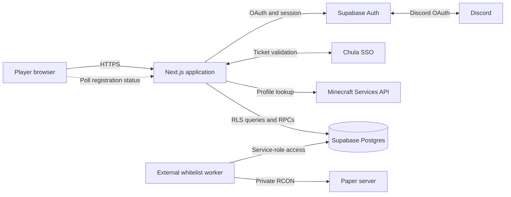

# ChulaCraft Web

Public website, authentication gateway, and whitelist-registration portal for the ChulaCraft Minecraft Java Edition community.

Players can explore the server, sign in, submit a Java Edition username, and follow its synchronization status. The app validates Minecraft profiles and stores the desired whitelist state in Supabase. It does **not** connect directly to Paper or RCON; a separate worker on the Minecraft host is responsible for applying database changes to the server.

## What is included

- Responsive landing, about, registration, error, and custom 404 pages
- Discord OAuth through Supabase Auth
- Chula SSO ticket callback and CU profile metadata handling
- Authenticated Minecraft Java username registration
- Canonical profile lookup through the Minecraft Services API
- Supabase Postgres schema with RLS, uniqueness constraints, RPC-based writes, and durable per-user rate limiting
- Pending, synchronized, failed, and revoked registration states
- Unit tests with Vitest and multi-viewport browser audits with Playwright
- Security headers, bounded Supabase/Minecraft requests, and safe authentication redirects

## Architecture

| Layer | Technology | Responsibility |
| --- | --- | --- |
| Web application | Next.js 16 App Router, React 19, TypeScript | Pages, authentication callbacks, registration API, and session refresh |
| Hosting | Vercel-compatible Node.js runtime | HTTPS, deployments, and public build-time configuration |
| Authentication | Supabase Auth | Discord OAuth sessions, cookies, and user metadata |
| Database | Supabase Postgres | Registrations, row-level security, synchronization state, and durable rate limiting |
| Profile validation | Minecraft Services API | Resolves a Java username to its canonical name and UUID |
| Server synchronization | External whitelist worker | Polls Supabase and applies changes to Paper through private RCON |



Only browser-safe Supabase configuration belongs in the web deployment. The Supabase service-role key and RCON password belong on the private Minecraft host, not in this repository or Vercel.

## Request flows

### Discord authentication

1. The browser calls `supabase.auth.signInWithOAuth({ provider: "discord" })`.
2. Discord returns to Supabase at `https://<project-ref>.supabase.co/auth/v1/callback`.
3. Supabase redirects to `/auth/callback` with a one-time code.
4. The callback exchanges the code for a cookie-backed session and redirects to `/welcome`.
5. `src/proxy.ts` refreshes Supabase sessions for application routes.

The application callback is deliberately fixed to `/welcome`; arbitrary `next` parameters are ignored.

### Chula SSO

1. `/register` builds a Chula login URL whose service callback is `/auth/cucallback`.
2. Chula returns a ticket to the callback.
3. The callback validates the ticket with Chula's `serviceValidation` endpoint.
4. For an existing Supabase session, CU profile fields are stored in user metadata.
5. The route otherwise attempts to provision a Supabase magic-link session and then redirects to `/welcome`.

Chula SSO currently assumes an HTTPS callback, including in the browser-side URL builder. See [Current implementation caveats](#current-implementation-caveats) before treating CU-only registration as production-ready.

### Minecraft registration

`POST /api/registration` performs the following checks in order:

1. Verifies the current Supabase user.
2. Applies a best-effort in-memory IP limit.
3. Calls `consume_registration_attempt()` for the authoritative limit of five attempts per authenticated user in ten minutes.
4. Accepts only 3–16 letters, numbers, or underscores.
5. Resolves the canonical username and UUID through `api.minecraftservices.com`.
6. Calls the security-definer `register_minecraft_profile` database function.
7. Returns only the safe browser registration view.

The request never supplies its owner ID. The database derives ownership from `auth.uid()`. Uniqueness constraints allow one registration per user and one owner per Minecraft UUID.

### Whitelist synchronization

New records begin with:

```text
desired_whitelisted = true
sync_status = pending
```

While a record is pending or failed, the browser polls `GET /api/registration` every 3.5 seconds. The external worker is expected to process due rows and update their synchronization fields.

| State | Meaning |
| --- | --- |
| `pending` | Saved in Supabase and waiting for the Minecraft host |
| `synced` | The worker reports that Paper accepted the desired state |
| `failed` | The last worker attempt failed and may be retried |
| `desired_whitelisted = false` | An operator revoked the registration |

This asynchronous boundary keeps registrations durable while the Minecraft host is unavailable.

## Routes

| Route | Purpose |
| --- | --- |
| `/` | Public landing page, Discord sign-in, community link, and server-address card |
| `/about` | Community mission, values, and server overview |
| `/register` | Public Discord or Chula sign-in page; authenticated users redirect to `/welcome` |
| `/welcome` | Protected Minecraft registration and synchronization status |
| `/auth/callback` | Discord/Supabase authorization-code exchange |
| `/auth/cucallback` | Chula ticket validation and CU profile handling |
| `/auth/error` | Safe user-facing authentication failure page |
| `/api/registration` | Authenticated registration read/write API |
| Any unknown route | Custom Minecraft-themed 404 page |

## Repository structure

```text
.
├── public/                     Static images and local Minecraftia font
├── src/
│   ├── app/                    App Router pages, auth callbacks, and API route
│   ├── components/             Shared navigation, auth, registration, and UI components
│   ├── lib/                    Environment, validation, error, timeout, and Supabase helpers
│   └── proxy.ts                Supabase session-refresh proxy
├── supabase/
│   ├── migrations/             Postgres schema, grants, RLS, triggers, and RPCs
│   ├── tests/                  Database security and privilege test cases
│   └── config.toml             Local Supabase CLI configuration
├── tests/visual/               Playwright multi-viewport rendering audits
├── visual-results/             Checked-in visual review artifacts
├── OPERATOR_RUNBOOK.md         Deployment, recovery, and incident procedures
├── playwright.config.ts        Browser-audit configuration and Supabase stub server
└── vitest.config.ts            Unit-test configuration
```

## Requirements

- Node.js 20.9 or newer (required by the installed Next.js version)
- npm (the repository is locked with `package-lock.json`)
- A Supabase project with Auth and Postgres enabled
- A Discord application/provider for Discord login
- Chula SSO application credentials for the Chula sign-in button, which is always rendered on `/register`
- Supabase CLI only when running the local database stack or applying migrations from the CLI
- Playwright's Chromium browser when running the visual suite

## Environment

Copy the committed template; never copy or commit a populated `.env` file.

```bash
cp .env.example .env.local
```

```env
NEXT_PUBLIC_SUPABASE_URL=https://YOUR_PROJECT_REF.supabase.co
NEXT_PUBLIC_SUPABASE_PUBLISHABLE_KEY=sb_publishable_REPLACE_ME
NEXT_PUBLIC_SITE_URL=http://localhost:3000
NEXT_PUBLIC_MINECRAFT_SERVER_ADDRESS=mc.example.com

NEXT_PUBLIC_CHULA_SSO_APP_ID=
CHULA_SSO_APP_SECRET=
```

| Variable | Required | Used for |
| --- | --- | --- |
| `NEXT_PUBLIC_SUPABASE_URL` | Yes | Public Supabase project URL |
| `NEXT_PUBLIC_SUPABASE_PUBLISHABLE_KEY` | Yes | Browser-safe Supabase publishable key |
| `NEXT_PUBLIC_SITE_URL` | Recommended; required for a stable production origin | Canonical server-side auth and redirect origin |
| `NEXT_PUBLIC_MINECRAFT_SERVER_ADDRESS` | No | Address displayed and copied on the landing page |
| `NEXT_PUBLIC_CHULA_SSO_APP_ID` | For Chula SSO | Chula application identifier exposed to the browser URL builder |
| `CHULA_SSO_APP_SECRET` | For Chula SSO | Server-only credential sent to Chula ticket validation |

If `NEXT_PUBLIC_SITE_URL` is absent, the server tries `VERCEL_PROJECT_PRODUCTION_URL`, then `VERCEL_URL`, then `http://localhost:3000`. These Vercel variables are platform-provided and do not belong in `.env.example`.

All `NEXT_PUBLIC_` values are embedded into the client build where used. Redeploy after changing production values. `CHULA_SSO_APP_SECRET` must never receive the `NEXT_PUBLIC_` prefix.

## Local development

Install dependencies and start Next.js:

```bash
npm ci
npm run dev
```

Open <http://localhost:3000>.

For a local Supabase stack:

```bash
supabase start
supabase db reset
```

The first registration migration creates:

- `minecraft_registrations`
- `registration_attempt_windows`
- `consume_registration_attempt()`
- `register_minecraft_profile(uuid, text)`
- update/reset triggers, grants, and RLS policies

The migration at `supabase/migrations/20260821183459_chula_sso_identities.sql` is currently empty and makes no database changes.

### Supabase Auth configuration

For local Discord sign-in, allow:

```text
http://localhost:3000/auth/callback
```

For production, configure the canonical site and callback:

```text
Site URL:     https://your-domain.example
Redirect URL: https://your-domain.example/auth/callback
```

The redirect URI configured in the Discord application itself must be the Supabase provider callback:

```text
https://<project-ref>.supabase.co/auth/v1/callback
```

## Commands

| Command | Purpose |
| --- | --- |
| `npm run dev` | Start the Next.js development server |
| `npm run build` | Create a production build |
| `npm run start` | Serve the production build |
| `npm run lint` | Run ESLint across the repository |
| `npm run typecheck` | Run TypeScript without emitting files |
| `npm test` | Run Vitest unit tests once |
| `npm run test:visual:list` | List Playwright visual-audit cases |
| `npm run test:visual` | Build the app and audit six routes across four viewport projects |

The visual suite starts a local Supabase stub on port `3211`, builds the app, serves it on port `3210`, checks rendering/runtime errors and horizontal overflow, and writes screenshots/artifacts under `visual-results/`.

Recommended verification:

```bash
npm run lint
npm run typecheck
npm test
npm run build
npm run test:visual:list
```

Run `npm run test:visual` when changing layouts, assets, routing behavior, or authentication-page rendering. The SQL cases in `supabase/tests/database_security.test.sql` require an auth-enabled Supabase test project and are not executed by `npm test`.

## Deployment

1. Apply the reviewed Supabase migration to the target project.
2. Enable and configure the Discord provider in Supabase Auth.
3. Set the web environment variables in Vercel or the chosen Node.js host.
4. Add the production domain and exact auth redirect URLs.
5. Build and deploy the application.
6. Smoke-test sign-in, a real Minecraft lookup, registration creation, and worker synchronization.

`next.config.ts` sends `X-Content-Type-Options`, `X-Frame-Options`, `Referrer-Policy`, and `Permissions-Policy` headers. It also permits optimized remote images only from Discord's CDN hosts.

## Security and operational boundaries

- Browser users can select only `minecraft_username`, `desired_whitelisted`, `sync_status`, and `updated_at` for their own row.
- Registration writes go through a security-definer RPC; direct browser writes are not granted.
- The authoritative registration-attempt window is private and derives its user from `auth.uid()`.
- The IP limiter is only best effort and trusts the deployment proxy's first `X-Forwarded-For` value.
- Supabase requests are bounded to eight seconds by default, and the Minecraft profile lookup is bounded to seven seconds.
- The web host must not receive the Supabase service-role key or RCON password.
- RCON should remain private to the Minecraft host/network. Only the Minecraft gameplay port should be publicly exposed.
- Revoking or re-approving a registration resets synchronization state so the worker can reconcile the new desired state.

See `OPERATOR_RUNBOOK.md` for launch order, recovery, troubleshooting, backups, revocation, and secret rotation. Its `minecraft/...` paths refer to the external Minecraft-host deployment tree, which is not included in this repository.

## Current implementation caveats

These are code-backed constraints in the current repository, not intended architecture:

- `register_minecraft_profile` still requires a Discord identity from `auth.identities`. A CU-only Supabase user cannot complete Minecraft registration with the current migration.
- The unauthenticated Chula callback attempts `supabase.auth.admin.generateLink()` using the normal server client, which is configured with the public publishable key. Supabase admin APIs require trusted server credentials, but no such credential is defined for this web app. New CU-only user provisioning therefore needs a secure backend design before production use.
- The Chula callback URL builder forces `https://`, so the button is not usable against the default plain-HTTP local development origin without additional HTTPS setup.
- Chula ticket validation currently uses an unbounded upstream `fetch`; unlike Supabase and Minecraft requests, it has no timeout or cancellation signal.
- Chula callback failures are routed through an error page whose current copy is Discord-specific.
- The whitelist worker and Paper/RCON integration are external to this repository; this codebase can only store and display synchronization state.

Until those items are resolved, Discord OAuth is the complete registration path represented by the database schema.
