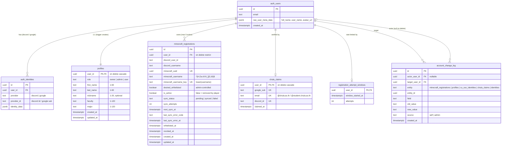
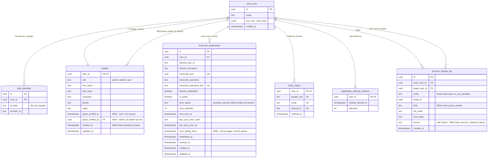

# ChulaCraft — Redesign + Implementation Plan

Status: **PR 1 (Phases 1–6) and PR 2 (Phases 7–8) implemented on `feat/redesign`, uncommitted** · 2026-10-04
Source design: Claude Design project `43b08df9-3d2e-4e49-873f-4128551ae7d0` (16 files)

---

## 1. Goal

Re-skin **every page** to the new Claude Design ("pixel-plum" style). Build the backend pieces the design needs that don't exist yet.

Fixed inputs:
- Landing hero image: `public/images/landingpage-bg.png`
- Logo (header + favicon): `public/images/chulacraft-logo.webp`

Out of scope:
- **The Minecraft sync worker stays exactly as it is.** Nothing in this plan needs a worker change. It keeps reading `minecraft_registrations` (`desired_whitelisted`, `is_active`, `minecraft_uuid`) and writing `sync_status` / `sync_attempts` / `last_sync_error_*`. Guest support and every new admin number are done in the database (columns, trigger, RPCs) on top of what the worker already does.
- `AdminServer` page. It's linked from the design but has no design file, so it shows as a "Coming soon" card.
- Community / Audit log tools. These are "Coming soon" in the design too.

---

## 2. Design → route map

| Design file | Route | Main files | Backend status |
|---|---|---|---|
| SiteHeader (`out` / `in` / `admin`) | all | `components/site-header.tsx`, `brand.tsx` | ✅ exists |
| SiteFooter | all | `components/site-footer.tsx` | ✅ exists |
| Landing | `/` | `app/page.tsx`, `home.module.css` | ✅ static |
| About | `/about` | `app/about/*` | ✅ static |
| Legal (`privacy` / `terms`) | `/privacy`, `/terms` | `components/legal-page.tsx` | ✅ static |
| Error (`404` / `auth`) | `not-found.tsx`, `/auth/error` | `app/not-found.*`, `app/auth/error/*` | ✅ exists |
| Register (`default` / `unavailable`) | `/register` | `app/register/*`, `registration-panel.tsx` | ✅ exists |
| Verify (`default` / `used` / `notchula` / `failed`) | `/verify` | `app/verify/page.tsx` | ✅ exists |
| **AboutYou** (`empty` / `errors` / `filled`) | `/register/details` | `about-you-form.tsx`, `about-you.module.css` | ✅ `update_profile_details` |
| Welcome (`progress` / `almost` / `allset`) | `/welcome` | `app/welcome/page.tsx` | ✅ derives from existing data |
| Dashboard | `/dashboard` | `app/dashboard/*` | ⚠️ partial (see §5) |
| Admin (overview) | `/admin` | `app/admin/page.tsx` | ❌ stats + activity RPCs |
| AdminPlayersHub + AdminPlayers (search) | `/admin/players` **(new)** | `app/admin/players/page.tsx` | ✅ search · ❌ stats + newest RPC |
| AdminRestore | `/admin/restore` | `app/admin/restore/*` | ✅ exists |
| AdminUser | `/admin/users/[id]` | `app/admin/users/[id]/*` | ⚠️ needs "mark as guest" |

The hub and the search are one page. With no `?q` it shows the stats, tool cards and newest players. With `?q=` it shows the search results. The current `/admin` (search list) moves there, and `/admin` becomes the overview dashboard. Every link that points at `/admin` today needs updating: `admin/layout.tsx`, `users/[id]/page.tsx` ("← All players"), `users/[id]/actions.ts` (redirect) and `api/dev-login`.

---

## 3. Design system (Phase 1)

**Fonts** (`src/lib/fonts.ts`, all loaded with `next/font/google`). These replace Inter, Rajdhani and Minecraftia.
- `Atkinson Hyperlegible` 400/700 → body text, `--font-body`
- `Pixelify Sans` 500/600/700 → headings, `--font-display`
- `IBM Plex Mono` 500 → addresses, UUIDs, emails, `--font-mono`

**Tokens** (`globals.css :root`; these replace the current variables):

| Token | Value | Use |
|---|---|---|
| `--bg` | `#201a2b` | page background |
| `--surface` | `#2a2238` | cards / panels |
| `--surface-2` | `#352b47` | secondary buttons, dividers |
| `--surface-hover` | `#41355a` | hover |
| `--sunken` | `#18131f` | inputs, footer |
| `--edge` | `#4a3d60` | 2px inset borders |
| `--text` | `#f7f1fc` | primary text |
| `--text-2` | `#cbbedb` | secondary text |
| `--text-3` | `#a596b8` | hints, muted |
| `--pink` | `#ff6fae` (hover `#ff8cbe`) | primary action |
| `--pink-soft` | `#ffd6e7` | links |
| `--lavender` | `#c3a6ff` | pending / guest |
| `--green` | `#9bd29d` | success / synced |
| `--amber` | `#f5c46b` | warning / retrying |
| `--danger` | `#ff7f91` (bg `#3a2232`) | errors / destructive |

**Shared classes** (in `globals.css`, so they aren't repeated inline on every element):
- `.pixel-4` / `.pixel-8`: stepped pixel-corner `clip-path` (4px and 8px). Not `.px-*`, which reads as "padding-x".
- `.btn`, `.btn-primary`, `.btn-secondary`, `.btn-ghost`, `.btn-danger`: 44–56px min height, inset bevel shadow
- `.panel`, `.alert` (with `--tone`), `.badge` (with `--tone`), `.field` / `.input` / `.select`
- Focus ring: `outline:none; box-shadow: inset 0 0 0 2px var(--text), inset 0 0 0 4px var(--bg)`
- `.sr-only`, plus a global `prefers-reduced-motion` rule

**Implementation rules**
- Pages stay Server Components. Only interactive parts become client components:
  - Copy-address button
  - Forms using `useActionState`
  - Dialogs (native `<dialog>`)
  - Mobile menu (stays on `<details>`)
- The design files use `?state=` preview props. Those become real data and URL search params (e.g. `?error=used`).
- Delete orphaned CSS: old `home.module.css` / `about.module.css` rules and the `--green` / `--blue` aliases.

---

## 4. ERD — current (as of migration `20261003000001`)



**Current RPCs (all `security definer`)**

| Group | Functions |
|---|---|
| Player | `add_minecraft_account`, `change_minecraft_account`, `remove_minecraft_account`, `consume_registration_attempt`, `update_profile_details`, `am_i_chula_verified` |
| Identity | `claim_chula`, `is_chula_email`, `is_chula_verified`, `log_identity_change`, `hook_only_discord_signups` |
| Admin | `current_app_role`, `admin_search_users`, `admin_get_user`, `admin_set_whitelisted`, `admin_set_role`, `admin_reset_chula`, `admin_removed_accounts` |
| Internal | `log_account_change`, `revoked_by_admin`, `set_updated_at`, `reset_sync_on_desired_state_change`, `create_profile_for_new_user` |

Indexes: `minecraft_registrations (user_id)`, `(next_sync_at) where desired_whitelisted`, `account_change_log (target_user_id, created_at desc)`.

---

## 5. Gap analysis: what the design needs vs. what the DB has

| Design element | Page | Needs | Change |
|---|---|---|---|
| Edit personal info | Dashboard | `update_profile_details` | none (reuse) |
| Add / replace / remove Minecraft account | Dashboard | `add/change/remove_minecraft_account` via `/api/registration/minecraft` (POST/PATCH/DELETE) | none (reuse) |
| Link / unlink personal Google | Dashboard | `auth.identities` + `unlinkPersonalGoogle` | none |
| Sync badge: Synced / Pending / Retrying / Revoked | Dashboard, AdminUser | `sync_status` + `desired_whitelisted` | none (UI mapping: `failed`→Retrying, `!desired_whitelisted`→Revoked) |
| **"Mark as verified (guest)"** | AdminUser | stored guest flag + who/when | **new columns + RPC** |
| **Guest badge**, Verified / Unverified / Guest | AdminUser, Players hub, search | verification kind per user | **extend `admin_search_users` / `admin_get_user`** |
| **Stats**: players, verified, guests, unverified, whitelisted, pending, retrying, oldest wait, removed | Admin, Players hub | aggregate counts | **new RPC `admin_overview_stats`** |
| **Recent admin activity** (last 5) | Admin | `account_change_log where source='admin'` + names | **new RPC + index** |
| **Newest players** | Players hub | `profiles.created_at` + status | **new RPC + index** |
| Change log on player | AdminUser | `account_change_log` | none (already in `admin_get_user`) |
| Join-server checklist (steps 1–5) | Welcome | identities + claim + MC rows | none |

---

## 6. ERD — new (proposed migration `20261004000001_redesign_admin.sql`)

Two tables change: `profiles` gets 2 columns and `minecraft_registrations` gets 1 trigger-maintained column. Everything else is RPCs. Columns marked "NEW" are new.



### 6.1 Schema diff

| Object | Change | Why |
|---|---|---|
| `profiles.guest_verified_at timestamptz null` | **add** | Guest verification state. Null means not a guest. |
| `profiles.guest_verified_by uuid null → auth.users(id) on delete set null` | **add** | Records which admin let them in |
| check `guest_verified_by is null or guest_verified_at is not null` | **add** | Keeps the two columns consistent |
| `minecraft_registrations.sync_failing_since timestamptz null` | **add** | When the current failure streak started. Feeds the admin overview's "Oldest waiting X hours". |
| trigger `minecraft_registrations_zz_failing_since` (before update) | **add** | `failed` after anything else → `now()`; any non-`failed` status → `null`; stays the same while still failing. The `zz_` prefix matters: Postgres fires BEFORE triggers alphabetically, and this one must run **after** `minecraft_registrations_reset_sync_on_desired_change`, which can turn `failed` into `pending`. The **worker is unchanged**: it keeps writing `sync_status` and the trigger derives the timestamp. |
| backfill | **once** | Rows that are already `failed` get `sync_failing_since = coalesce(last_sync_error_at, updated_at)`. That's approximate for those rows only; new failures are exact. |
| grants | none | New columns are **not** granted to `authenticated` and are read only through RPCs |

Considered and dropped:
- **Extra indexes.** At about 200 players, sequential scans are instant. Add `profiles (created_at desc)` and `account_change_log (created_at desc) where source='admin'` when the admin pages get slow.
- **Tightening the `entity` check** to remove `cu_sso_identities`. It isn't related to the redesign; do it separately.

Considered and rejected: a separate `guest_verifications` table. It would be 1:1 with `profiles` and add nothing over two columns.

### 6.2 Verification model (new)

```
verification_kind(user) =
  'verified'   if is_chula_verified(user)        -- existing logic, unchanged
  'guest'      elif profiles.guest_verified_at is not null
  'unverified' otherwise
```

- **New** `is_player_verified(uid) = is_chula_verified(uid) OR guest`. It replaces `is_chula_verified` at the one access gate: `add_minecraft_account`, which raises `CU_SSO_REQUIRED`.
- **New** `am_i_player_verified()` replaces `am_i_chula_verified()`. Keeping the old name would make it lie about what it checks, and there are only 2 callers to switch: `verify/page.tsx` and `lib/verified-user.ts`. The old function is dropped in follow-up migration `20261004000002` (see deploy order).
- `admin_reset_chula` also clears `guest_verified_*`, so after a reset the user is "Unverified" in every case (decided ✅).
- A guest who opens `/verify` gets redirected to `/welcome`, like a Chula-verified user does today.

### 6.3 RPC changes

| RPC | Type | Returns | Guard |
|---|---|---|---|
| `admin_mark_guest(p_user_id uuid)` | **new** | void | admin/owner. Fails if already Chula-verified. Logs `profiles.guest_verified` with source `admin`. |
| `admin_overview_stats()` | **new** | `players, verified, guests, unverified, whitelisted_accounts, pending_sync, retrying_sync, oldest_failing_since, removed_accounts`. Accounts count only if `is_active and desired_whitelisted`; `oldest_failing_since = min(sync_failing_since)`. | admin/owner. `ponytail:` calls `is_chula_verified` once per user (several `auth.identities` lookups each); fine at about 200 players, move to a set-based join if it gets slow. |
| `admin_recent_activity(p_limit int default 5)` | **new** | `created_at, actor_name, field, entity, old_value, new_value, target_user_id, target_name` | admin/owner, limit capped at 50. The TS side turns `(entity, field, new_value)` into the design's sentences (e.g. `profiles.role=admin` → "changed role to admin for"). A single map in `lib/change-log.ts` is shared with the AdminUser change log. |
| `admin_newest_players(p_limit int default 5)` | **new** | `user_id, display_name, handle, verification_kind, created_at` | admin/owner, limit capped at 50 |
| `admin_search_users(p_query)` | **change** | adds `verification_kind` column | unchanged |
| `admin_get_user(p_user_id)` | **change** | adds `verification_kind`, `guest_verified_at`, `guest_verified_by_name`, `personal_google_email`, `discord_id` | unchanged |
| `admin_reset_chula(p_user_id)` | **change** | also clears guest columns | unchanged |
| `add_minecraft_account(...)` | **change** | gate on `is_player_verified` | unchanged |
| `am_i_player_verified()` | **new** (replaces `am_i_chula_verified`) | boolean | authenticated |
| `is_player_verified(uid)` | **new** | boolean | `service_role` only (same as `is_chula_verified`) |

Every new function follows the existing conventions: `security definer set search_path = ''`, `revoke all ... from public, anon`, and execute granted only where needed.

---

## 7. Phases

Two PRs. **PR 1 = redesign only (no DB changes).** It must restyle **every** page, admin included, because Phase 1 replaces the global tokens and any page left on the old CSS would break. **PR 2 = the guest model + admin data** (migration + the parts that depend on it).

### Phase 0 — Prep
1. **You** commit (or stash) the in-progress work: `register/details`, `faculties`, `dev-login`, migration `20261003000001`, `dev-seed.sql`, the image changes. Leave `tsconfig.tsbuildinfo` out (build artifact).
2. `git switch -c feat/redesign`.
3. Copy the design files into `.omc/research/design/` as the reference (gitignored).

## PR 1 — Redesign

### Phase 1 — Foundation
- `fonts.ts`, `layout.tsx` (favicon → `chulacraft-logo.webp`), `globals.css` tokens + shared classes.
- Remove `Inter` / `Rajdhani` / `Minecraftia` and every `--font-*` reference to them (11 files today), plus the `--green` / `--blue` aliases. Done in the same phase so nothing is left half-styled.
- `brand.tsx`: logo `chulacraft-logo.webp` + "ChulaCraft" wordmark in Pixelify Sans.
- `site-header.tsx`: three variants.
  - `out`: Home, About, Community, Register
  - `in`: adds an avatar menu with Profile and Sign out
  - `admin`: adds Admin to the menu
  - Plus active-link state and a `<details>` mobile menu
- `site-footer.tsx`: © ChulaCraft ✦ Java Edition only ✦ Privacy ✦ Terms.
- ✅ Check: `typecheck`, `lint`; header renders in all 3 auth states.

### Phase 2 — Public pages
- **Landing**:
  - Hero uses `next/image` with `src=/images/landingpage-bg.png` (1672×941), `fill`, `priority`, `sizes="(min-width: 1920px) 1920px, 100vw"`, `object-fit: cover`, inside a `max-width: 1920px` centred frame, plus the design's gradient overlay (one version for desktop, one for mobile).
  - Server-address card with a copy button (client island, `aria-live` "Copied").
  - 4 feature cards, the 4-step "How to join", and a pink CTA band.
- **About**, **Legal** (shared `legal-page.tsx` with numbered sections), **404** and **auth error** (one `ErrorScreen` component with the `404` and `auth` variants).
- ✅ Check: `legal-pages.test.tsx` updated; Lighthouse LCP on `/`.

### Phase 3 — Onboarding flow
- **Register**: Discord sign-in card; `unavailable` state when the service-unavailable flag is set.
- **Verify**: step indicator 2/3, accepted-domain chips, amber "Choose carefully" note, error alerts for `?error=used|notchula|failed`.
- **AboutYou**: first/last/nickname/faculty/major form; error summary plus inline per-field errors (`errors` state); pre-filled when editing (`filled`). Reuses `saveProfile` and `faculties.ts`.
- **Welcome**: the 5-step checklist, state derived server-side from identities / claim / MC rows; the `progress` / `almost` / `allset` headers.
- ✅ Check: `register/page.test.tsx`, `verify/page.test.tsx` updated; manual run through the flow with dev-login.

### Phase 4 — Player dashboard
- Personal info card with view and edit modes (reuses `saveProfile`).
- Sign-in methods: Discord, Chula Google (locked), Personal Google (link / unlink; `google-error` alert).
- Minecraft accounts:
  - List with sync badges, up to 5 accounts
  - Add form; inline "Replace" form; remove confirm `<dialog>`
- `load-error` and `empty` states.
- **Map every existing API error to a design state.** The design shows `invalid` / `notfound` / `taken`, but the API can also return a rate-limit error (`consume_registration_attempt`), the 5-account limit, `CU_SSO_REQUIRED` and an upstream Minecraft API timeout. Each gets an alert message; there is no design for them, so they reuse the `invalid` style.
- ✅ Check: `route.test.ts` passes unchanged (no API change); manual add / replace / remove, plus one forced error per state.

### Phase 5 — Admin restyle (existing data only)
- `/admin` → **move** the current search list to `/admin/players`. For now `/admin` redirects to `/admin/players`. Update the 4 links listed in §2.
- `/admin/players`: search form (GET `?q=`), loading skeleton (`loading.tsx`), initial / none / results states. The results show **Verified / Unverified** only (no guest yet).
- `/admin/restore`: list, empty state, restore confirm dialog.
- `/admin/users/[id]`:
  - Header card with badge + role
  - Details `<dl>`
  - Actions: reset Chula, role select + confirm; the owner promotion requires typing the handle
  - MC accounts table on desktop, cards on mobile, with restore
  - Change log, success flash, failure banner
- ✅ Check: each existing admin action still works; a non-admin gets a redirect from the `/admin` layout.

### Phase 6 — PR 1 checks
- `npm run typecheck && npm run lint && npm test`
- `npm run test:visual`. This spec **captures** full-page screenshots but doesn't compare them against baselines, so it only catches crashes, overflow and wrong status codes. Review the visual changes by hand: open the captured screenshots at each viewport next to the design.
- Accessibility pass: keyboard-only through every page; focus visible; one `h1` per page; 44px targets.
  - Contrast (measured): `#a596b8` passes on every surface (6.15 / 5.53 / 4.82). The placeholder colour `#8f80a3` on `#2a2238` is 4.18, **below AA**; use `#a596b8` for placeholders on panels.
- `graphify update .`

## PR 2 — Guest model + admin data

### Phase 7 — DB migration
- `supabase/migrations/20261004000001_redesign_admin.sql` per §6.
- Update `supabase/dev-seed.sql` with one guest, one unverified and one retrying account, so every admin state can be seen locally.
- ✅ Check: `supabase db reset` locally, then one `supabase/tests/redesign_admin.sql` script with plain `assert`s:
  - Stats counts match the seed rows
  - A non-admin calling any admin RPC gets an exception
  - A guest can add a Minecraft account
  - A reset clears guest status
  - Setting `sync_status` `pending→failed` sets `sync_failing_since`; `failed→failed` keeps it; `failed→synced` clears it; an admin toggling `desired_whitelisted` on a failing row (reset to `pending`) clears it

### Phase 8 — Admin overview + guest UI
- `/admin` overview (replaces the redirect):
  - "Needs attention": "N accounts retrying sync · Oldest waiting X hours" (from `oldest_failing_since`), "N players haven't verified"; each card is hidden when its count is 0
  - Stats row
  - Category cards: Players (live), Minecraft server, Community, Audit log (soon)
  - Recent activity (last 5)
- `/admin/players` without `?q`: stats with colour rails, tool cards, newest players.
- `/admin/users/[id]`: "Mark as verified (guest)" action + dialog, Guest badge.
- Guest variants for players:
  - Welcome step 2 shows "Verified (guest)"
  - Dashboard hides the Chula row
  - `/verify` redirects guests away
- Switch the 2 callers to `am_i_player_verified`.
- ✅ Check: an admin can mark a guest; the guest can add an account; the action shows in the change log and recent activity.

### Deploy order (PR 2)
1. Apply the migration to production **first**. The old app still works on it because `am_i_chula_verified` is dropped only in a follow-up migration after the deploy, not in `20261004000001`.
2. Deploy the app.
3. Run follow-up migration `…02`: `drop function am_i_chula_verified`.

Rollback: the migration only adds columns and functions. To roll back, deploy the previous app; the extra columns are harmless. There's no down migration.

---

## 8. Risks / notes

- **Sync worker stays the same (decided).** Guests work because the only gate is `add_minecraft_account`; once a guest's row exists, the worker whitelists it like any other row. If the worker ever starts checking Chula verification on its own, guests would stop syncing; that's when it would need `is_player_verified`.
- **Already-failing rows get an approximate `sync_failing_since`** from the one-time backfill (see §6.1). This corrects itself as soon as each row syncs or fails again.
- **Hero image is 1672×941.** On screens wider than about 1672px it scales up slightly and goes soft behind the gradient. Mitigated in Phase 2: cap the hero at `max-width: 1920px` and centre it, so it scales up at most ~15% and the gradient overlay hides the softness. Swap in a 2400px+ export later with no code change.
- **Guest gate change** touches `add_minecraft_account`, the only player-facing SQL change; see deploy order.
- **Dead links in the design** (`AdminServer.dc.html`, `#discord`): these become "Coming soon" and `discordCommunityUrl` respectively.
- **Scope.** PR 1 restyles about 14 pages + header/footer, and the dashboard design alone has 15 states. It's split into one commit per phase (1–6), and each commit passes `typecheck` + `lint` + `test` on its own, so it can be reviewed and reverted phase by phase.

## 9. Decisions

| # | Decision | Status |
|---|---|---|
| 1 | Admin URLs: `/admin` (overview) → `/admin/players` (hub **and** search, `?q=`) → `/admin/users/[id]` | ✅ decided |
| 2 | Guest model: two columns on `profiles` | ✅ decided |
| 3 | "Reset Chula link" also removes guest status | ✅ decided |
| 4 | Two PRs (redesign → DB + admin data) | ✅ decided, admin restyle moved into PR 1 |
| 5 | Sync worker unchanged; all new behaviour is in the DB | ✅ decided |
| 6 | "Oldest waiting" via trigger-maintained `sync_failing_since` (no worker change) | ✅ decided |
